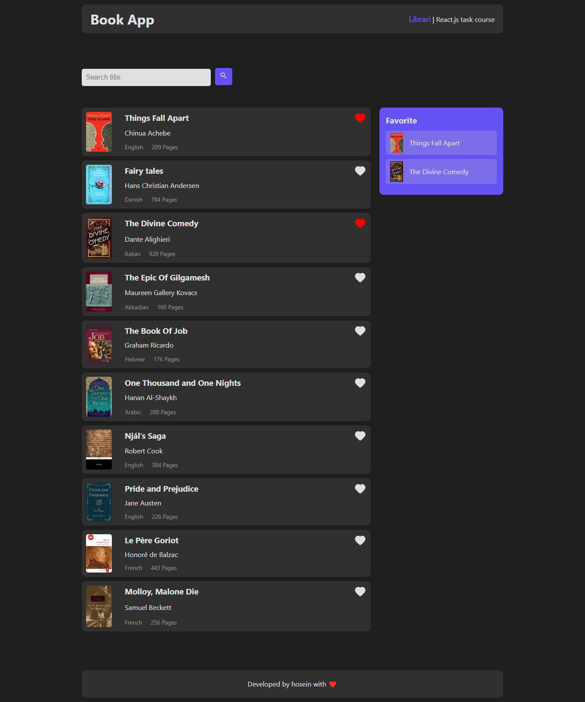

# React + Vite
## image website 

Project Title: BookWorm Library

# Description:

Welcome to the BookWorm Library, a React-based front-end project that transforms book exploration into an interactive and enjoyable experience. This application allows users to search for books by name and express their appreciation by liking them. Dive into the world of literature with a user-friendly interface that combines search functionality and a personalized liking system.

# Key Features:

Book Search: Users can easily search for books by entering their names, making it convenient to discover a wide array of literary works.

Dynamic Results: The search results dynamically update as users type, providing real-time feedback and making the search process seamless and efficient.

Book Likings: Each book can be liked with a simple click, allowing users to create a personalized collection of their favorite books.

Like Counter: The number of likes for each book is displayed, giving users an insight into the popularity of various literary works within the BookWorm community.

Responsive Design: The application is built with a responsive design, ensuring a consistent and visually appealing experience across different devices.

Interactive UI Elements: The UI elements are designed to be interactive, with clear indicators for search results, liked books, and the like button.

State Management: Utilizing React state management, the application ensures that user interactions are seamlessly reflected in the UI.

Technologies Used:

React.js
React state management
Responsive design principles
How to Run:

Clone the repository from [GitHub Repo Link].
Navigate to the project directory.
Run npm install to install dependencies.
Run npm start to start the development server.
Open the application in your browser at http://localhost:3000.
Note:

This project is a front-end demonstration. For a complete application, it would need to be integrated with a backend for data persistence and user authentication.

Feel free to explore the code, make enhancements, and use it as a foundation for creating engaging and user-centric library applications.

Happy reading!

Currently, two official plugins are available:

- [@vitejs/plugin-react](https://github.com/vitejs/vite-plugin-react/blob/main/packages/plugin-react/README.md) uses [Babel](https://babeljs.io/) for Fast Refresh
- [@vitejs/plugin-react-swc](https://github.com/vitejs/vite-plugin-react-swc) uses [SWC](https://swc.rs/) for Fast Refresh
